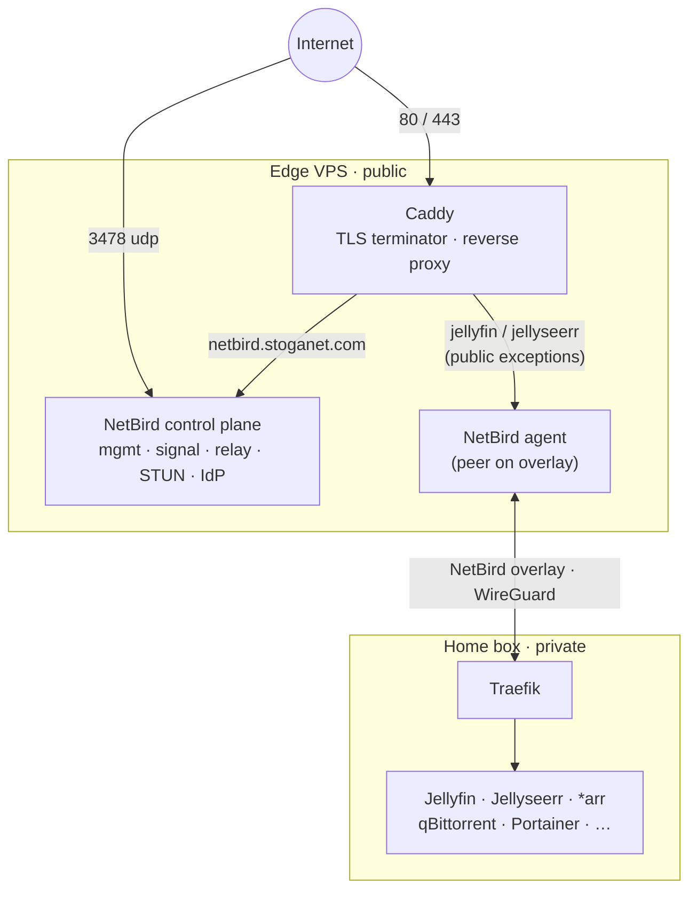

# Stoganet/edge

Public-facing edge proxy for the Stoganet home infrastructure. Runs on a small VPS and:

- Terminates TLS for `*.stoganet.com`
- Hosts the self-hosted NetBird control plane (management, signal, relay, STUN, dashboard, embedded IdP)
- Reverse-proxies the few public services (Jellyfin, Jellyseerr) back to the home box over the NetBird overlay

The home box and all of the \*arr stack stay behind NetBird — they are never directly exposed to the internet.



## Layout

```
edge/
├── compose/      Docker Compose stack (Caddy + self-hosted NetBird control plane)
└── docs/         Architecture notes
```

## Deploy

```
git clone https://github.com/Stoganet/edge.git /srv/stoganet
cd /srv/stoganet/compose

cp services.env.example .env
$EDITOR .env

cp netbird/config.yaml.example netbird/config.yaml
$EDITOR netbird/config.yaml          # set authSecret, encryptionKey, exposedAddress, auth.issuer

NB_SETUP_KEY=... ./setup.sh          # Docker, NetBird agent + join, UFW, proxy-net, /var/log/caddy

docker compose up -d                 # caddy
cd netbird && docker compose up -d   # netbird control plane
```

The VPS joins its own NetBird overlay as a peer — that overlay IP is what Caddy uses to reach the home box for the Jellyfin/Jellyseerr reverse proxies.

## Public surface

| Port      | Service                               |
| --------- | ------------------------------------- |
| 80, 443   | Caddy (all `*.stoganet.com` hosts)    |
| 3478/udp  | NetBird STUN                          |
| 22        | SSH                                   |

Everything else is NetBird-only.

## Deploying

Production deploys are a one-click flow in GitHub:

1. Go to **Actions → Deploy** and click **Run workflow** (leave `ref` blank to deploy `main`).
2. Watch the run. The workflow summary reports one of three outcomes:
   - `deploy-ok` — on the target SHA, healthchecks green
   - `rolled-back` — deploy failed, rolled back to the previous SHA, healthchecks green on the previous SHA
   - `MANUAL INTERVENTION REQUIRED` — both deploy and rollback failed; SSH to the VPS over the public IP to investigate

`main` is "next batch ready to ship" — Renovate auto-merges low-risk PRs there. Nothing is live on the VPS until you click Run workflow. The workflow has no `push` or `pull_request` trigger, so Renovate / Dependabot cannot deploy.

### Manual recovery

If the workflow is wedged or the runner can't reach the VPS, SSH to the VPS as the operator and run the same scripts the workflow runs:

```bash
sudo -iu deploy /srv/stoganet/bin/deploy.sh <sha>
sudo -iu deploy /srv/stoganet/bin/rollback.sh <sha>
sudo -iu deploy /srv/stoganet/bin/diagnostics.sh
```

### One-time VPS bootstrap

Run on the VPS as the operator:

```bash
sudo useradd -m -s /bin/bash -G docker deploy
sudo -u deploy mkdir -p ~deploy/.ssh
sudo chmod 700 ~deploy/.ssh
# Paste the public half of DEPLOY_SSH_KEY into:
sudo -u deploy tee -a ~deploy/.ssh/authorized_keys
sudo chmod 600 ~deploy/.ssh/authorized_keys

sudo chown -R deploy:deploy /srv/stoganet
```

### One-time GitHub setup

Add these repo secrets (`Settings → Secrets and variables → Actions`):

| Secret | Value |
| ------ | ----- |
| `NB_SETUP_KEY` | NetBird setup key (reusable + ephemeral, scoped to a `deploy-runners` group with minimal ACL) |
| `DEPLOY_SSH_KEY` | Private half of an ed25519 keypair generated for CI (`ssh-keygen -t ed25519 -f deploy_key -N ""`) |
| `VPS_OVERLAY_IP` | The VPS's NetBird overlay IP |
| `VPS_SSH_HOST_KEY` | Output of `ssh-keyscan -t ed25519 localhost` run on the VPS |
