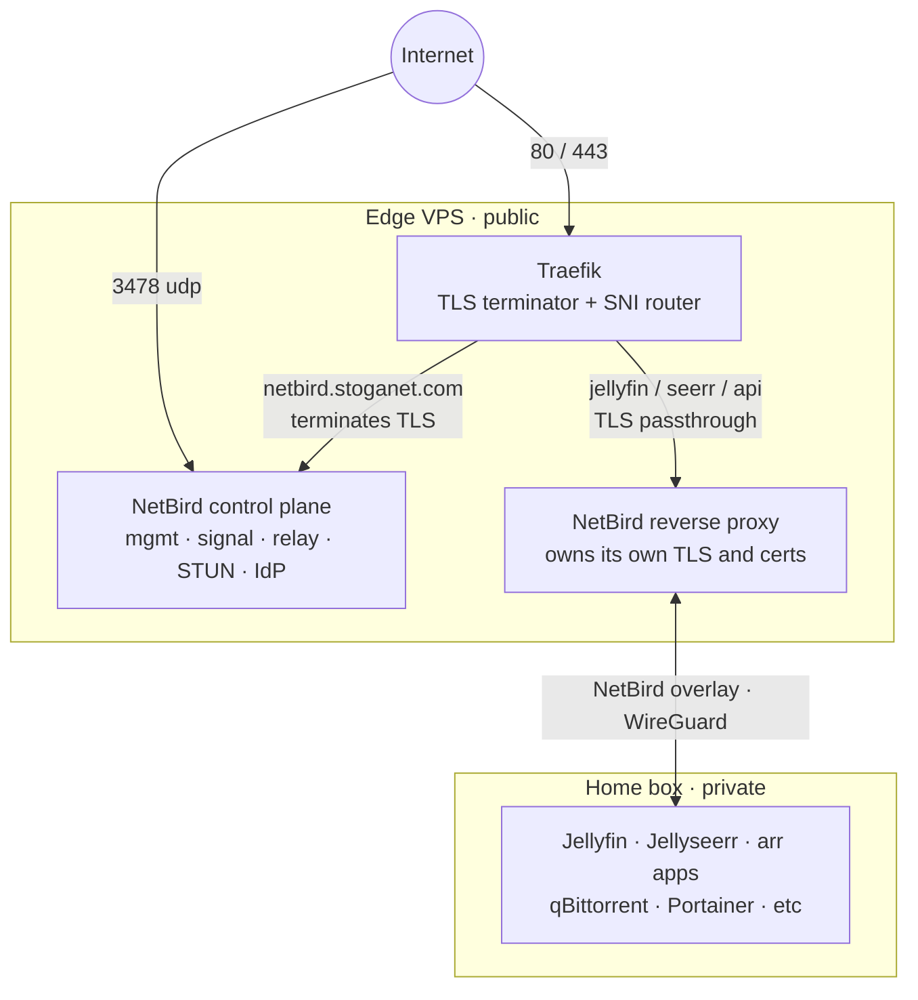

# Stoganet/edge

This is the public edge for the Stoganet home infrastructure. It runs on a small VPS and handles three jobs:

* Terminates TLS for `*.stoganet.com` using Traefik
* Runs its own NetBird control plane (management, signal, relay, STUN, dashboard, with an embedded identity provider)
* Publishes a few services from the home box (Jellyfin, Jellyseerr, an api proxy) through NetBird's built in reverse proxy feature

Everything else stays behind NetBird and is never exposed to the internet directly.



The home box runs its own separate Traefik. Different machine, different job. Don't confuse the two.

## Layout

```
edge/
└── compose/netbird/   Docker Compose stack: Traefik, the NetBird control plane, and the reverse proxy
```

## Public surface

Only these ports are open to the internet:

* 80 and 443: Traefik, serving every `*.stoganet.com` host
* 3478/udp: NetBird STUN
* 22: SSH

Traefik's own dashboard, on port 8080, binds only to the NetBird mesh IP. It is never public. Everything else is reachable only through NetBird.

***

Operational details such as deploy steps, secrets, and VPS bootstrap live in [`AGENTS.md`](AGENTS.md).
